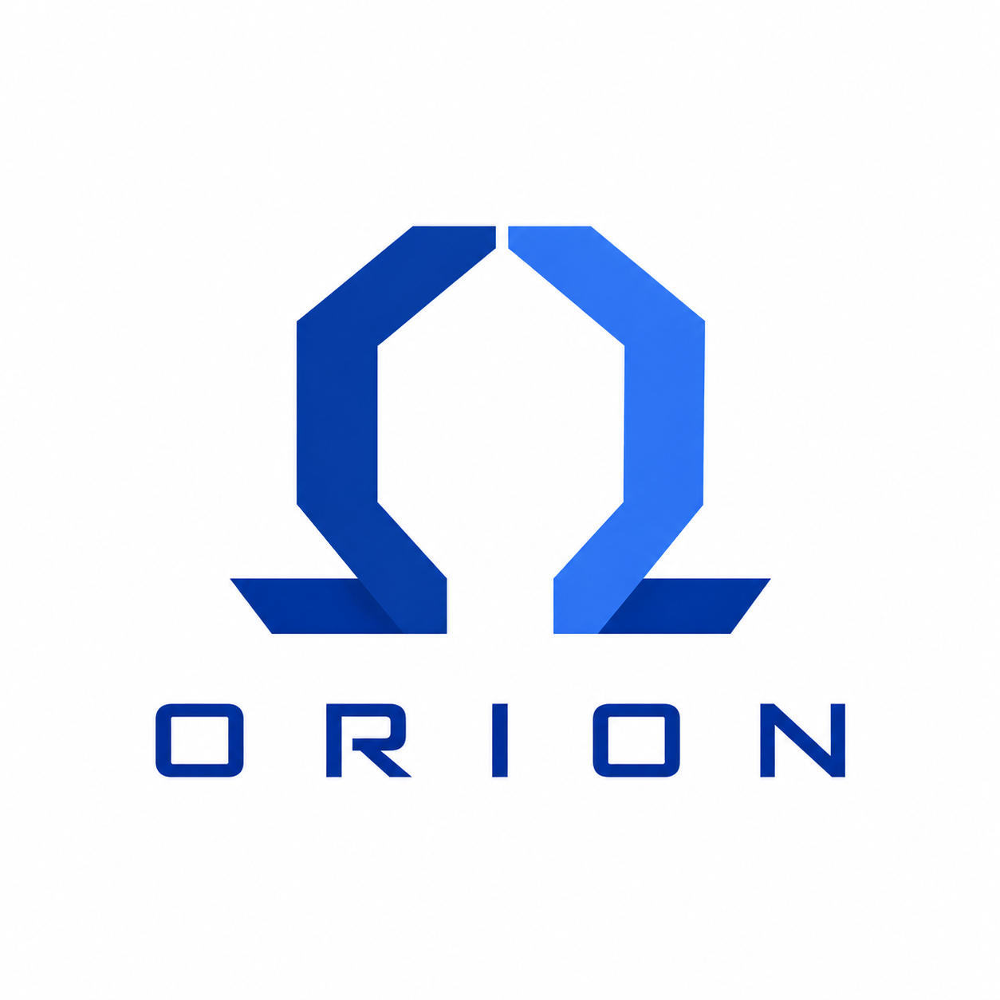

<p align="center">
  
</p>

# Orion → Go Transpiler

Transpiler for the **Orion** language to **Go**, written in Go.

## Usage

```bash
# Build the transpiler
go build -o orionc ./cmd/orion/main.go

# Transpile a .ori file
./orionc my_program.ori

# Transpile and run
./orionc -run my_program.ori

# View tokens and AST (debug)
./orionc -debug my_program.ori
```

---

## Orion syntax

### Variables
```orion
string name = "hermes";
integer age = 45;
bool is_male = true;
float pi = 3.14;
```

### Conditionals (`if / or_if / or`)
```orion
if is_male {
    io::write("is male");
} or_if age > 30 {
    io::write("older");
} or {
    io::write("default");
}
```

### Functions with return values
```orion
string helloName (string name) {
    ::("hello, $name !");   // implicit return with interpolation
}
string hello = helloName("hermes");
```

### Void functions
```orion
writeScreen () {
    io::write("hello, world");
}
writeScreen();
```

### Arrays
```orion
[string] names = ["hermes", "lucas"];

// Iteration
for index, value :: names {
    io::write(value);
}

// Array methods
names:push("gusta");
names:pop();
names:first();
names:last();
names:remove(0);
names:removeValue("hermes");
```

### String interpolation
```orion
string greeting = "hello, $name !";
```

### I/O
```orion
io::write("hello, world");
io::write(variable);
```

---

## Project structure

```
orion/
├── cmd/orion/main.go          # CLI
├── internal/
│   ├── lexer/
│   │   ├── token.go           # Token definitions
│   │   └── lexer.go           # Tokenizer
│   ├── parser/
│   │   └── parser.go          # Parser (tokens → AST)
│   ├── ast/
│   │   └── ast.go             # AST nodes
│   └── codegen/
│       └── codegen.go         # Go code generator
├── example.ori                # Orion example
└── go.mod
```

## Type mapping

| Orion     | Go        |
|-----------|-----------|
| `string`  | `string`  |
| `integer` | `int`     |
| `bool`    | `bool`    |
| `float`   | `float64` |
| `[T]`     | `[]T`     |
